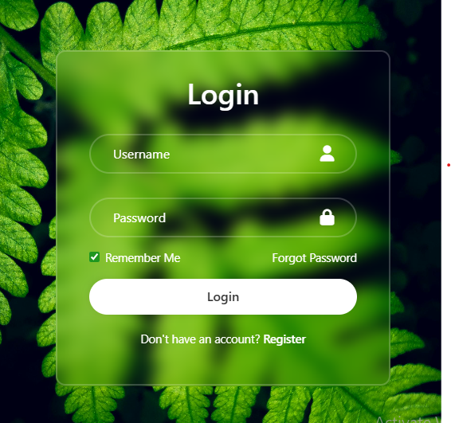

# Glassmorphism Login Form

A stylish static login page built with **HTML**, **SASS**, and **Bootstrap**, featuring subtle input animations and a glassmorphism-inspired UI. The project focuses on clean design, smooth interactions, and modern CSS techniques.

## ✨ Features

- Glassmorphism-style form card using `backdrop-filter`
- Animated floating labels for input fields
- Responsive layout powered by Bootstrap utilities
- Font Awesome icons for better UI clarity
- Custom checkbox styling using the `accent-color` property
- Clean and modular SASS architecture

## 🛠️ Technologies Used

- **HTML5** – Markup structure
- **SASS (SCSS)** – Styling and modular CSS architecture
- **Bootstrap** – Layout, spacing, and responsiveness
- **Font Awesome** – Input field icons

## 📸 Preview

The login form sits on a full-screen background image with a blurred, translucent card overlay. Input labels animate smoothly when focused or filled, providing a modern and intuitive user experience.

> ## 🔗 Live Demo
[Glassmorphism Form live demo](https://fr1nk5sh.github.io/Glassmorphism-Login-Form/)
> ## 📸 Screenshot


## 🚀 Getting Started

To run this project locally:

1. Clone the repository

   ```bash
   git clone https://github.com/fr1nk5sh/your-repo-name.git

   ```

2. Open index.html directly in your browser
   or
   Use a live server extension for a better development experience.

3. (Optional) Compile SASS if you make changes

   ```bash
    sass sass/main.scss assets/css/styles.css --watch

   ```

🎯 Purpose of the Project
This project was built to:

- Practice modern UI styling techniques like glassmorphism
- Improve SASS structuring and nesting
- Experiment with subtle CSS animations for better UX
- Create a clean and reusable login form layout

🔧 Possible Improvements
- Add JavaScript form validation
- Improve accessibility (ARIA labels, contrast tuning)
- Add dark/light mode toggle
Convert to a React or Vue component

📄 License
This project is open-source and available for learning and inspiration.
